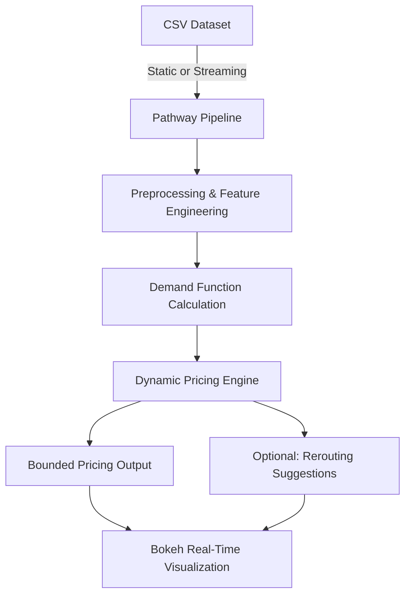

# 🚗 Dynamic Pricing for Urban Parking Lots  
**Summer Analytics 2025 Capstone Project**  
_Consulting & Analytics Club × Pathway_

---

## 📌 **Project Overview**

Urban parking spaces in cities are scarce and high in demand. Static pricing often leads to inefficiency: lots can become overcrowded or underutilized.  
This project simulates an **intelligent, demand-based dynamic pricing engine** for 14 urban parking spaces.  
The model adjusts prices in near real-time using data streams on occupancy, queue length, traffic levels, vehicle type, special days, and competitor prices.  
The goal is to optimize space utilization and revenue while keeping prices reasonable and predictable.

---

## ⚙️ **Tech Stack**

- **Python** (`numpy`, `pandas`)
- **Pathway** for real-time data ingestion & streaming pipelines
- **Google Colab** for development & simulation
- **Bokeh** for real-time visualization
- **Mermaid** for architecture diagrams (in documentation)

---

## 🗺️ **Architecture Diagram**



---

## 🧩 **Project Architecture & Workflow**

1. **Data Ingestion**  
   - 73 days of occupancy and traffic data for 14 parking lots  
   - Read statically (`pw.io.csv.read`) or replay as streaming (`pw.demo.replay_csv`)

2. **Feature Engineering**  
   - Calculate key demand factors:  
     - Occupancy rate  
     - Queue length  
     - Traffic congestion  
     - Special day/event indicator  
     - Vehicle type weighting

3. **Demand Function**  
   - A linear demand function combines all factors:
     ```
     Demand = α*(Occupancy/Capacity) + β*QueueLength − γ*Traffic + δ*IsSpecialDay + ε*VehicleType
     ```
   - Demand is **normalized** to keep the pricing smooth.

4. **Dynamic Pricing**  
   - Base price starts at $10  
   - Final price:
     ```
     Price = BasePrice × (1 + λ × NormalizedDemand)
     ```
   - Prices are bounded to stay within `0.5×` to `2×` base price.

5. **Optional: Competitive Logic**  
   - Incorporates competitor lots’ prices and suggests rerouting if over capacity.

6. **Visualization**  
   - Real-time Bokeh plots show:
     - Current price trajectory  
     - Competitor price comparison  
     - Occupancy trends

---

## ✅ **How to Run**

1. **Clone the Repository**
   ```bash
   git clone https://github.com/your-username/urban-parking-dynamic-pricing.git
   cd urban-parking-dynamic-pricing
   ```

2. **Open in Google Colab**
   - Upload or link the provided `.ipynb` notebook(s).
   - Ensure you have the dataset `parking_stream.csv`.

3. **Install Dependencies**
   ```bash
   pip install pathway pandas numpy bokeh
   ```

4. **Run the Notebook**
   - For **static mode**, use:
     ```py
     data = pw.io.csv.read("parking_stream.csv", schema=ParkingSchema)
     ```
   - For **streaming mode**, use:
     ```py
     data = pw.demo.replay_csv("parking_stream.csv", schema=ParkingSchema)
     ```

5. **Visualize**
   - The notebook generates Bokeh plots in real-time.

---

## 📄 **Report**

If you have a report PDF, add it to the repo under `/docs/` and mention:
> 📌 **Full Report:** [Download here](./docs/your_report.pdf)

---

## 🔓 **Repository Access**

- ✅ All code files (`.ipynb`), dataset, and documentation included.
- ✅ Please make sure the repository is **public** or share explicit access with reviewers.

---

## 📣 **Contact**

**Team:** [Your Team/Name]  
**Summer Analytics 2025 — Consulting & Analytics Club, IIT Guwahati**
