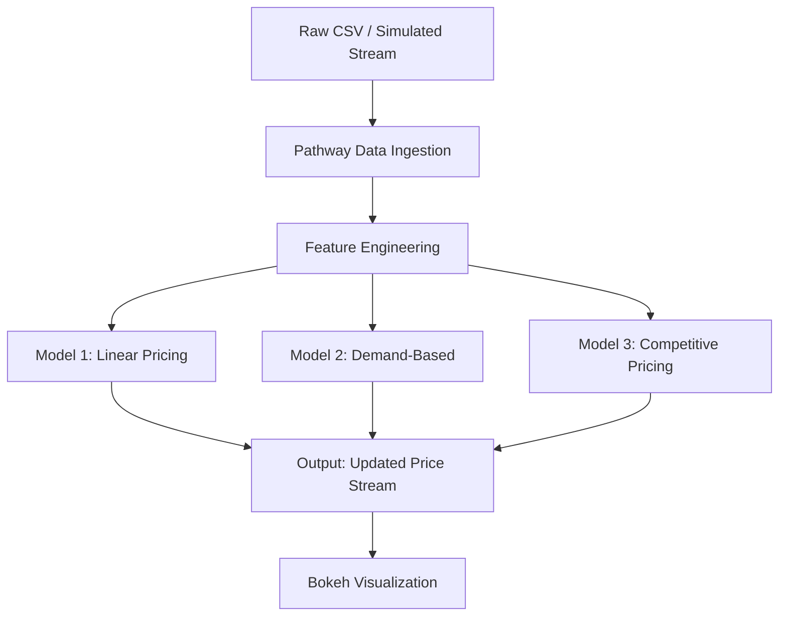

# 🚗 Dynamic Pricing for Urban Parking Lots

Capstone Project — Summer Analytics 2025  
**Organized by:** Consulting & Analytics Club × Pathway  
**Participants:** Ayush Kumar (IIT Guwahati)

---

## 📌 Project Overview

This project simulates a dynamic pricing system for urban parking lots using real-time data. The aim is to optimize parking space utilization by adjusting prices based on occupancy, demand, and competition. The solution is implemented in Python using Pandas, NumPy, and the real-time data processing library Pathway.

We developed three pricing models of increasing complexity:
- **Model 1:** Baseline Linear Model
- **Model 2:** Demand-Based Pricing Model
- **Model 3:** Competitive Pricing Model with rerouting logic

---

## 🧠 Tech Stack

- **Python** (Pandas, NumPy)
- **Pathway** (real-time data ingestion and processing)
- **Google Colab** (notebook environment)
- **Bokeh** (visualization)
- **Geopy** (for geolocation proximity in Model 3)

---

## 🔁 Model Architecture

### 📈 Model 1: Baseline Linear Model
A simple price adjustment model:
```
Price(t+1) = Price(t) + α × (Occupancy / Capacity)
```

### 📊 Model 2: Demand-Based Pricing
We define a demand function using:
- Occupancy Rate
- Queue Length
- Traffic Level
- Special Day Indicator
- Vehicle Type

**Demand Function:**
```
Demand = α × (Occupancy / Capacity) + β × QueueLength − γ × Traffic 
         + δ × IsSpecialDay + ε × VehicleTypeWeight
```

**Price Update Rule:**
```
Price(t) = BasePrice × (1 + λ × NormalizedDemand)
```

- Demand is normalized between 0 and 1
- Prices are bounded between **0.5×Base** and **2×Base**

### 📍 Model 3: Competitive Pricing with Rerouting
Incorporates spatial and competitive logic:
- Uses latitude-longitude to find nearby lots
- Adjusts prices based on:
  - Whether nearby lots are cheaper or expensive
  - Whether current lot is full
- Can suggest rerouting to nearby lots if required

---

## 🧭 Architecture Diagram



---

## ⚙️ Workflow

1. **Data Streaming:** Simulate real-time parking data using Pathway.
2. **Feature Engineering:** Extract required fields (occupancy, queue, traffic, etc.).
3. **Apply Models:** Run models sequentially:
    - Model 1 for baseline
    - Model 2 for demand-based dynamic pricing
    - Model 3 (optional) for competitive, intelligent rerouting
4. **Price Update:** Emit pricing updates using Pathway
5. **Visualization:** Real-time Bokeh plots for price behavior and trends

---

## 📂 Project Structure

- `model1.ipynb`: Implements baseline linear pricing
- `model2.ipynb`: Implements demand-based pricing function
- `model3.ipynb`: Adds competition logic and spatial intelligence
- `dataset.csv`: Input data for simulation
- `README.md`: This documentation

---

## 📝 Assumptions

- Demand is linearly correlated with selected features
- All models are bounded to ensure realistic price adjustments
- Vehicle type weights are predefined (e.g., Car = 1.0, Bike = 0.5, Truck = 1.5)
- Competition logic uses nearest 2-3 lots within a 500m radius

---

## 📊 Output

- Real-time pricing graphs (per parking lot)
- Smooth transitions (avoiding erratic jumps)
- Visual comparison of competitor vs. own price
- Optional rerouting messages (Model 3)

---

## 🔗 Resources

- [Pathway Developer Docs](https://pathway.com/developers/user-guide/)
- [C&A Club Summer Analytics](https://www.caciitg.com/sa/course25/)


---

## 🔗 Google Colab Notebooks

- ▶️ [Model 1: Baseline Linear Model](https://colab.research.google.com/drive/1TwGVIQ0JwDR9jrWjIFXx2PD_OK0cVMKD?usp=sharing)
- ▶️ [Model 2: Demand-Based Price Function](https://colab.research.google.com/drive/10DB5cZnURwJUWppjnnjGzkD2oK10IvCC?usp=sharing)
- ▶️ [Model 3: Competitive Pricing Model](https://colab.research.google.com/drive/1OOOUDt7eNDrMMFcNFmH_Tu2s6rXskVVT?usp=sharing)

---
---

## 📣 Note

This project is a simulation exercise aimed at improving pricing intelligence in urban infrastructure. All models are intentionally simple and open to further refinement (e.g., using ML models, reinforcement learning, etc.).
